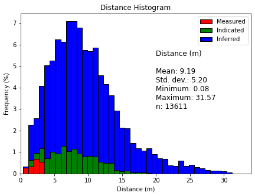

# DistClass_Histogram
 A function to create the Minimum Distance (or average distance) X Classification Histogram from a block model file.
 It was designed originally to work with a block model files where there are the Minimum Distance or Average Distance variable, and the Resource Classification variable.
 
 ## Mandatory libraries
 To this function, the four libaries below are necessary.
```python
import pandas as pd
import numpy as np
import math
import matplotlib.pyplot as plt
```

 ## Function inputs
 There are 6 inputs to the function, being these:
 - df: dataframe with the distance and classification variable.
 - bins: number of bins for the final histogram - this is an user parameter.
 - xdist: distance variable in the dataframe. It must be numeric.
 - yvar: classification variable. It can be numeric or alphanumeric.
 - clas: string with the classification cathegories given by the user, and it needs to be in order from measured to inferred, or 1 to 3, depending on the user's workflow. Example: ['MEAS', 'IND', 'INF'] or [1, 2, 3].
 - position: X and Y position of the label, according with the X and Y chart axis

All of the input variables are mandatory. See below an example using the default database on the repository.
```python
chart_data(df, 40, 'Min Dist', 'Classification', ['MEAS', 'IND', 'INF'], [20, 3])
 or
fig = chart_data(df, 40, 'Min Dist', 'Classification', ['MEAS', 'IND', 'INF'], [20, 3]) 
```

## Function output
 The output of the function is a chart with the minimum or average distance on X axis, frequency (%) on the Y axis, distance variable statistics, and coloured by the classification variable - see below.
 
